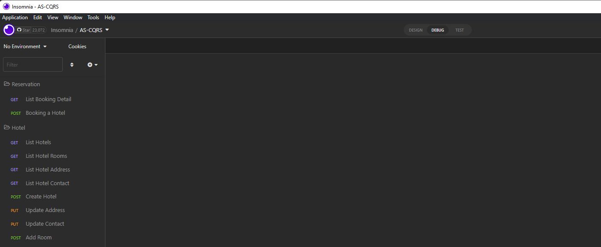

# O que é EmergingBooking?

EmergingBooking é um projeto open-source criado para dar suporte ao curso [AS CQRS](https://www.emergingcode.com.br/arquitetura-de-software-cqrs/), com o objetivo de apresentar a implementação do Padrão _**Arquitetural CQRS**_. Esse é um projeto que faz alusão a sistemas de Reserva de quartos de Hoteis. Para enriquecer a experiência desse projeto, foram utilizadas algumas técnicas do DDD (Domain-Driven Design) para facilitar a implementação da separação de Domínios e implementação das regras de negócio. [Clique aqui](https://www.emergingcode.com.br/arquitetura-de-software-cqrs/) para mais detalhes.

O projeto conta com algumas funcionalidades:

- **Gestão de Hoteis**
    - Cadastrar hotel
    - Incluir quartos em um hotel
    - Alterar enderço do hotel
    - Alterar contatos do hotel
- **Pesquisar quartos disponíveis**
- **Reservar Quarto**

# Arquitetura do Projeto

Pensar em arquiteturas de projetos, é uma tarefa de alta responsabilidade da pessoa que está por trás do desenho arquitetural de um sistema. Para isso acontecer de uma forma adequada às necessidades dos requisitos de um negócio, existem muitas variáveis para serem analisadas.

Em um sistema de Booking (Reserva), é possível perceber que existem fatores críticos que precisam ser levados em consideração no momento do desenho de uma arquitetura que seja possível suporte esse tipo de negócio online. A gestão dos dados de um hotel não pode impactar a reserva desse hotel, por exemplo.

Para dar resposta ao entendimento dos conceitos que separam o universo de implementação CQS do outro universão que é o CQRS (Padrão cunhado pelo [Greg Young](https://www.youtube.com/watch?v=LDW0QWie21s), com base nos fundamentos do _**CQS**_, criado por [Bertrand Mayer](https://en.wikipedia.org/wiki/Bertrand_Meyer)), aplicado em projetos .NET. O projeto foi pensado e desenhado para estruturar uma solução que seja possível suprir a carga operações de escrita, separadamente da carga de operações de leituras, usando para isso o padrão arquitetural CQRS, sem uso de nenhum Framework relacionado com a arquitetura proposta (eg.: MediatR), como pode ser visto no diagrama abaixo.


No diagrama, é possível perceber como está pensada a arquitetura da solução, a arquitetura de organização das APIs e como cada um dos componentes dessa solução conversão entre si.

Para mergulhar em todas as decisões desse projeto [Clique aqui](https://www.emergingcode.com.br/arquitetura-de-software-cqrs/)

# Quais HTTP requests podem ser enviadas para as APIs?

Os testes manuais, realizados nas APIs deste projeto, foram realizados utilizando o software [Insomnia](https://insomnia.rest/download), e para facilitar os seus estudos, disponibilizamos um arquivo contento todas as configurações já pré-configuradas no arquivo [http-requests.json](./http-requests.json), estão listados na imagem abaixo:



# Visão geral das APIs

A imagem abaixo ilustra, de uma maneira geral, como está organizada a separação das APIs, Escrita e Leitura. Dependendo da responsabilidade da API, a visão da organização dos projetos de negócio, seguem as premissas do Domain-Driven Design ou outro estilo que melhor se adeque a necessidade.


## Tecnologias utilizadas

- [.NET 6.0](https://dotnet.microsoft.com/en-us/download/dotnet/6.0)
- [MonoidSharpDotNet](https://github.com/jr-araujo/MonoidSharpDotNet)
- [.NET Background Service](https://docs.microsoft.com/en-us/aspnet/core/fundamentals/host/hosted-services?view=aspnetcore-6.0&tabs=visual-studio)
- [Apache Kafka](https://kafka.apache.org/)
- [Apache Kafka Web UI](https://github.com/provectus/kafka-ui)
[- SQL Server 2022](https://www.microsoft.com/en-us/sql-server/)
- [RavenDB](https://ravendb.net/)
- [Polly](http://www.thepollyproject.org/)
- [Docker](https://www.docker.com/)
- [Docker Compose](https://docs.docker.com/compose/install/)
- [Powershell](https://docs.microsoft.com/en-us/powershell/)
- [Shell Script](https://www.shellscript.sh/)

# Como trabalhar com o repositório

#### **_Clonando o repositório_**

Ao baixar o repositório do projeto, atente-se onde você vai clonar o projeto. Dependendo do nível de profundidade de pastas que você use no momento de clonar o projeto, você pode cair no problema de limitação do número de caracteres que um PATH (caminho de pastas) pode ter no windows. Aconselhamos sempre clonar o projeto em uma pasta mais próxima do driver que você estiver usando (C:, D:, etc.)

#### **_Branch_**

Este repositório só possui uma única branch, chamada: **main**, assim que você baixar o repositório, você terá a versão FINAL do projeto. Para reconstruir esse projeto, você precisa acompanhar as vídeo aulas disponibilizadas na plataforma da Hotmart em sua área de membros, e também ficar atento(a) as descrições que existem em alguns vídeos e no grupo do telegram.

#### **_Automação do ambiente de desenvolvimento_**

Dentro da pasta [dev-setup](https://github.com/emergingcode/arquitetura-moderna-sw-cqrs-emergingbooking/tree/main/dev-setup) você vai encontrar todos os scripts de automação para criar os containers que serão usados no seu ambiente de desenvolvimento. Mas para esse script rodar 100%, o arquivo entrypoint.sh precisa estar formatado no formato UNIX. Para fazer isso, certifique-se de que esse arquivo está no formato unicode UNIX (LF). Caso contrário, você precisa converter esse arquivo.

> ❗PORQUE é necessário ter atenção a esse passo?

> O arquivo entrypoint.sh é responsável criar a base de dados e tabelas necessárias, dentro da instância do container SQL SERVER. Para esse shell script poder rodar com sucesso, dentro do container LINUX do SQL SERVER, o arquivo de script precisa estar no formato UNIX.


Abaixo existe 2 maneiras de realizar essa reformatação:

1. Usando o WSL2:

Existe um app linux chamado: [Dos2Unix](http://dos2unix.sourceforge.net/) que faz a reformatação de arquivos WIN para o formato UNIX. Baixe o app Dos2Unix e rode contra o arquivo [Entrypoint.sh](https://github.com/emergingcode/arquitetura-moderna-sw-cqrs-emergingbooking/blob/main/dev-setup/entrypoint.sh), que é responsável por criar a base de dados e as tabelas dentro da instância do SQL Server, conforme o comando abaixo:

```shell
$ dos2unix entrypoint.sh
```

Esse procedimento vai converter o arquivo para o formato UNIX (Linux). Esse passo é necessário porque quando o script [run.ps1](https://github.com/emergingcode/arquitetura-moderna-sw-cqrs-emergingbooking/blob/main/dev-setup/run.ps1) é executado, ele chama o docker-compose.yaml e, no passo que monta o SQL Server, o script **entrypoint.sh** é copiado para dentro do container LINUX do SQL Server e é então aplicado contra o SQL Server Linux.

Outro procedimento que pode ser usado para converter o arquivo [Entrypoint.sh](https://github.com/emergingcode/arquitetura-moderna-sw-cqrs-emergingbooking/blob/main/dev-setup/entrypoint.sh) para o formato UNIX, é utilizando o **NOTEPAD++**.

Abra o arquivo [Entrypoint.sh](https://github.com/emergingcode/arquitetura-moderna-sw-cqrs-emergingbooking/blob/main/dev-setup/entrypoint.sh) usando o NOTEPAD++, depois vá na opção apresentada na imagem abaixo e deixe marcada a opção _UNIX (LF)_.


⚠️ Sem essa conversão, a automação não vai instanciar o container do SQL Server conforme esperado.

✅ Pronto! Salve agora é só salvar o arquivo!

Para executar o script powershell [run.ps1](https://github.com/emergingcode/arquitetura-moderna-sw-cqrs-emergingbooking/blob/main/dev-setup/run.ps1), usando seu terminal que deve estar rodando o powershell, entre na pasta **dev-setup** e execute o comando abaixo:

```powerhsell
$ .\run.ps1
```

---

### Info do Curso: Arquitetura de Software CQRS

Gostou do que esse projeto te apresentou? Então, você vai ficar ainda mais satisfeito com o que o material do curso vai te oferecer, com o aprofundamento cheio de detalhes sobre cada uma das implementações que você encontrou aqui nesse projeto, conteúdos teóricos e práticos que vão enriquecer o seu Toolbelt de tecnologias. Com base nas formações dos outros alunos, te garanto que você vai dar um avanço grande na sua carreira.

Após concluir este curso, você vai ter aprendido as diferenças entre CQS e CQRS, tendo implementado CQRS de forma correta, compreendendo que CQS está relacionado aos padrões aplicados ao código, enquanto que CQRS foca em como a solução da sua arquitetura será definida. Para alcançar tudo isso você vai utilizar o sistema de mensageria mais cobiçado do mercado: Apache Kafka, você também vai implementar Serviços de Background usando a última versão do Aspnet Core: a versão 6.0, incluindo o desenvolvimento de Web APIs de escrita e leitura. Além disso, você também vai aprender a utilizar um banco de dados NoSql mais robustos do mercado e que desde a sua 1° versão trabalha com transações: RavenDB, além de aprender técnicas de modelagem usando Domain Driven Design, construindo uma arquitetura robusta e resiliente.

Esse curso vai te ajudar a alavancar a sua carreira como profissional de tecnologia.

[Clique aqui](https://www.emergingcode.com.br/arquitetura-de-software-cqrs/) para mais detalhes.

## Público Alvo
Desenvolvedores com 2+ de experiência, ArquitetXs de Software, Tech Leads, Team Leads, Tech Managers.

## Pré-Requisitos Desejaveis
- Conhecimento básico de desenvolvimento Web
- Conhecimento básico sobre a linguagem C#
- Conhecimento básico sobre HTTP/REST
- Conhecimento básico de mensageria
- Conhecimento básico de Padrões de Projeto